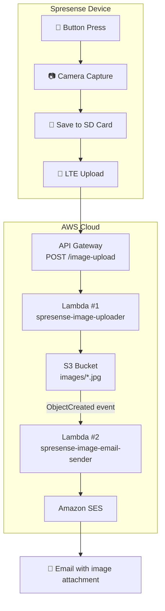

spresense-lte-aws-camera

One-button IoT camera system: captures JPEG on Sony Spresense, uploads 
via LTE to AWS (API Gateway → Lambda → S3 → SES), and delivers the 
image by email — no Wi-Fi required.

## Overview

Press a single button on the Spresense device and the following happens 
automatically:

1. Camera captures a JPEG image
2. Image is saved to SD card (permanent sequential file)
3. Image is uploaded via LTE to AWS API Gateway
4. Lambda function stores the image in S3
5. S3 event triggers a second Lambda function
6. Image is sent as an email attachment via Amazon SES

The system runs entirely on a mobile battery with no Wi-Fi or PC 
connection required.

## Performance

| Metric | Value |
|--------|-------|
| Boot time (including LTE) | ~30 seconds |
| Capture time | ~1 second |
| Upload time | 5–15 seconds |
| Time to email delivery | ~10–20 seconds from button press |
| Image size | ~60–100 KB (QUADVGA JPEG) |
| Monthly data usage | ~10 MB (100 images/month) |
| AWS cost (100 images/month) | $0.00 (within free tier) |

## System Architecture

## Hardware Requirements

| Component | Details |
|-----------|---------|
| Spresense Main Board | Sony CXD5602 (ARM Cortex-M4F) |
| Spresense Camera Board | 5MP CMOS sensor |
| Spresense LTE Extension Board | LTE Cat-M1 modem |
| SD Card | FAT32, 32 GB or less |
| Tact Switch | Connected between D01 pin and GND |
| SIM Card | Data SIM with APN credentials |
| Power Supply | USB or mobile battery (5V / 1A or more) |

## Repository Structure
'''
spresense-lte-aws-camera/
├── sketches/
│   └── spresense_lte_camera/
│       └── spresense_lte_camera.ino  — Spresense firmware (C++)
├── lambda/
│   ├── lambda_uploader.py            — Lambda #1: receives image, saves to S3
│   └── lambda_email_sender.py        — Lambda #2: sends image via SES email
└── docs/
├── SETUP.md                      — Complete setup guide
├── TROUBLESHOOTING.md            — Common issues and solutions
├── LED_GUIDE.md                  — LED status indicators
├── DEV_HISTORY.md                — Version history and lessons learned
└── PROJECT_OVERVIEW.md           — Full technical documentation
'''
## Quick Start

See [docs/SETUP.md](docs/SETUP.md) for complete setup instructions.

**Key configuration in firmware:**

```cpp
// LTE settings — replace with your carrier's APN
#define APP_LTE_APN       "your.apn.here"
#define APP_LTE_USER_NAME "your_username"
#define APP_LTE_PASSWORD  "your_password"

// AWS API Gateway endpoint
#define API_HOST "your-api-id.execute-api.ap-northeast-1.amazonaws.com"
#define API_PATH "/image-upload"
```

**Arduino IDE setting (required):**
Tools → Memory → 1536 KB

## AWS Components

| Component | Configuration |
|-----------|--------------|
| API Gateway | HTTP API, POST /image-upload, auto-deploy |
| Lambda #1 | Python 3.12, 128 MB, AmazonS3FullAccess |
| Lambda #2 | Python 3.12, 128 MB, AmazonS3ReadOnlyAccess + AmazonSESFullAccess |
| S3 | ap-northeast-1, private, SSE-S3 encryption |
| SES | ap-northeast-1, sandbox mode |

## LED Status

| State | LED Pattern |
|-------|------------|
| Booting | LEDs light up sequentially (LED0→1→2→3) |
| Ready | 🔴🔴🔴🔴 All ON |
| Uploading | ⚫⚫⚫⚫ All OFF |
| Success | LED3 blinks slowly × 3 |
| Failure | LED3 blinks fast × 5 |

See [docs/LED_GUIDE.md](docs/LED_GUIDE.md) for full details.

## Development History

This project evolved through four versions:

| Version | Key Change |
|---------|-----------|
| v1 | Initial implementation |
| v2 | Fixed Serial blocking issue for battery operation |
| v3 | Added LED visual feedback during upload |
| v4 | Fixed HTTP status code check bug |

See [docs/DEV_HISTORY.md](docs/DEV_HISTORY.md) for full details.

## Future Work

- Anomaly-triggered capture: use sensor data (pressure, temperature, 
  etc.) to trigger automatic image capture when abnormal values are 
  detected — enabling remote incident recording without manual 
  intervention
- AI-powered reporting: connect captured images to Claude API to 
  automatically generate situation reports or plant growth assessments 
  from visual data
- Multi-sensor integration: combine with edge AI inference 
  (e.g. edge-ai-phantom-sensor) to correlate visual and physical 
  sensor data

## Libraries & References

- [Spresense Arduino SDK](https://github.com/sonydevworld/spresense-arduino-compatible)
- [Spresense LTE Library](https://developer.spresense.sony-semicon.com/spresense-api-references-arduino/LTE_8h_source)
- [Spresense Camera Library](https://developer.spresense.sony-semicon.com/spresense-api-references-arduino/Camera_8h_source)
- [Amazon Root CA 1 Certificate](https://www.amazontrust.com/repository/AmazonRootCA1.pem)

## License

MIT License
